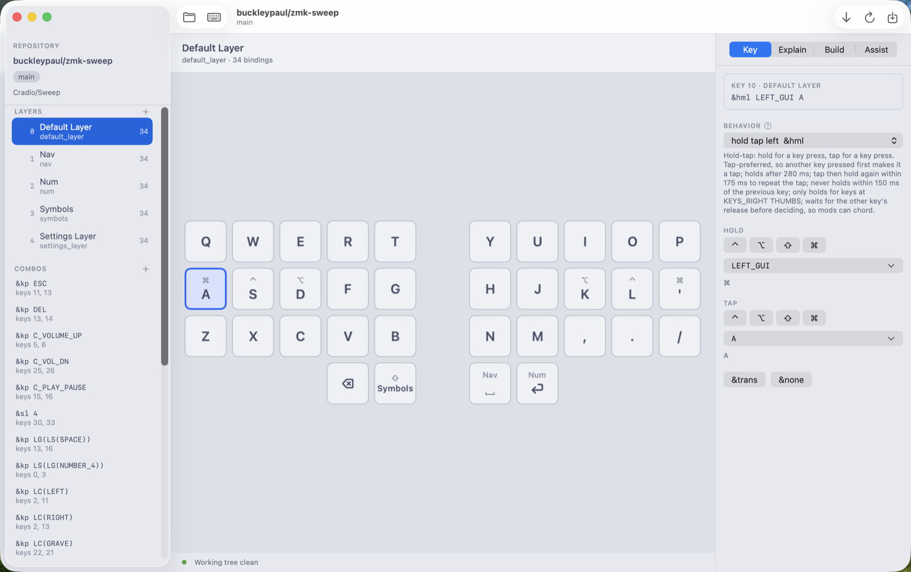
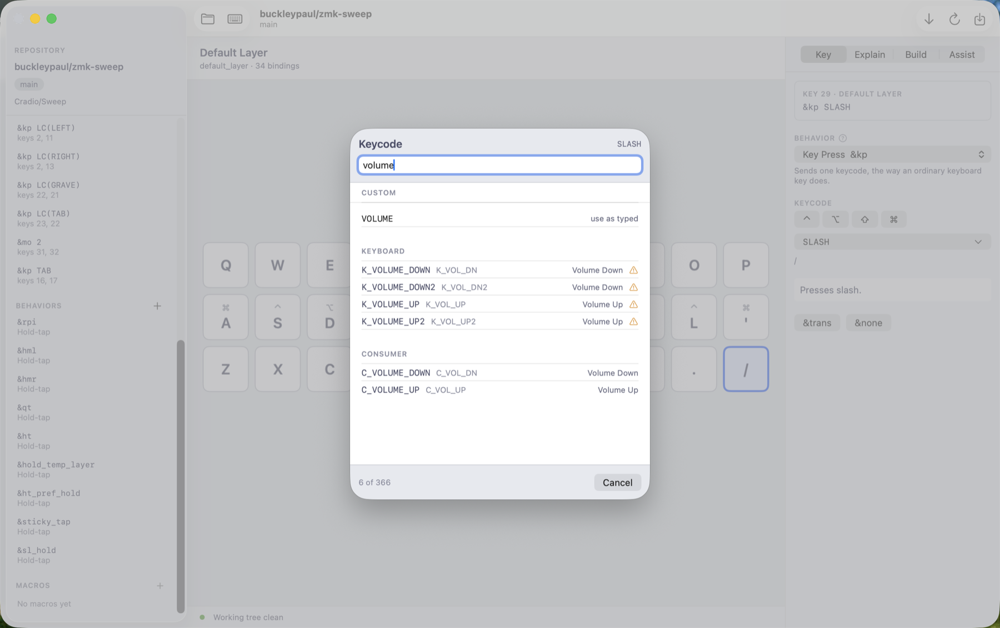
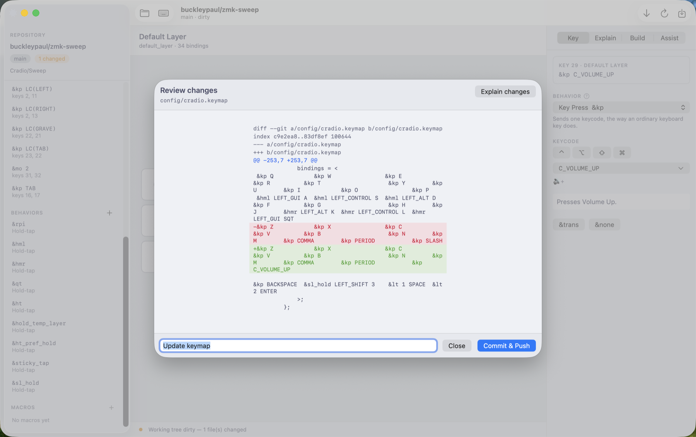
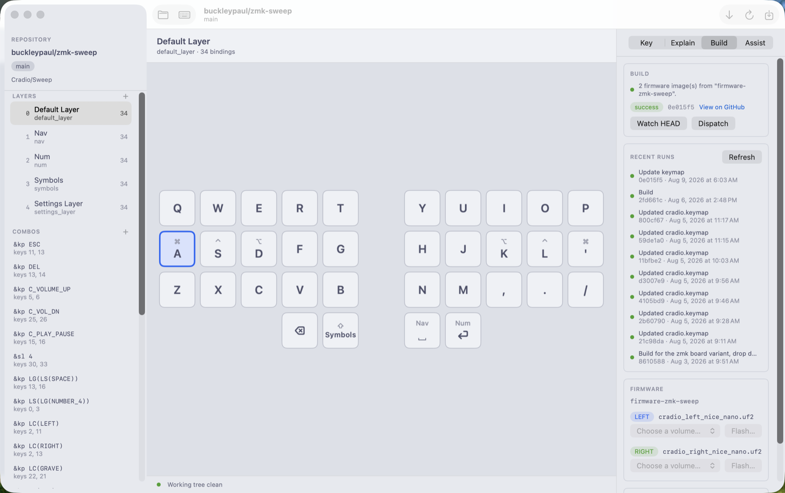
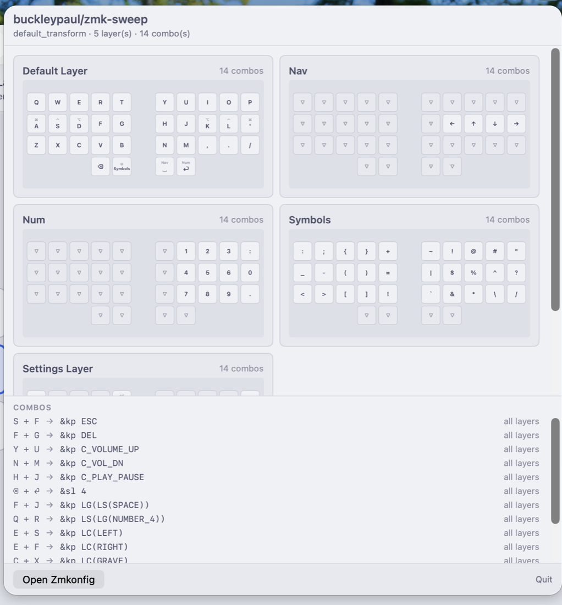
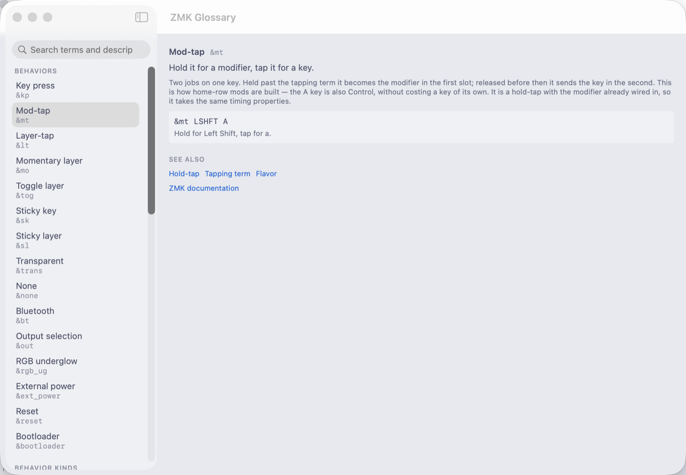
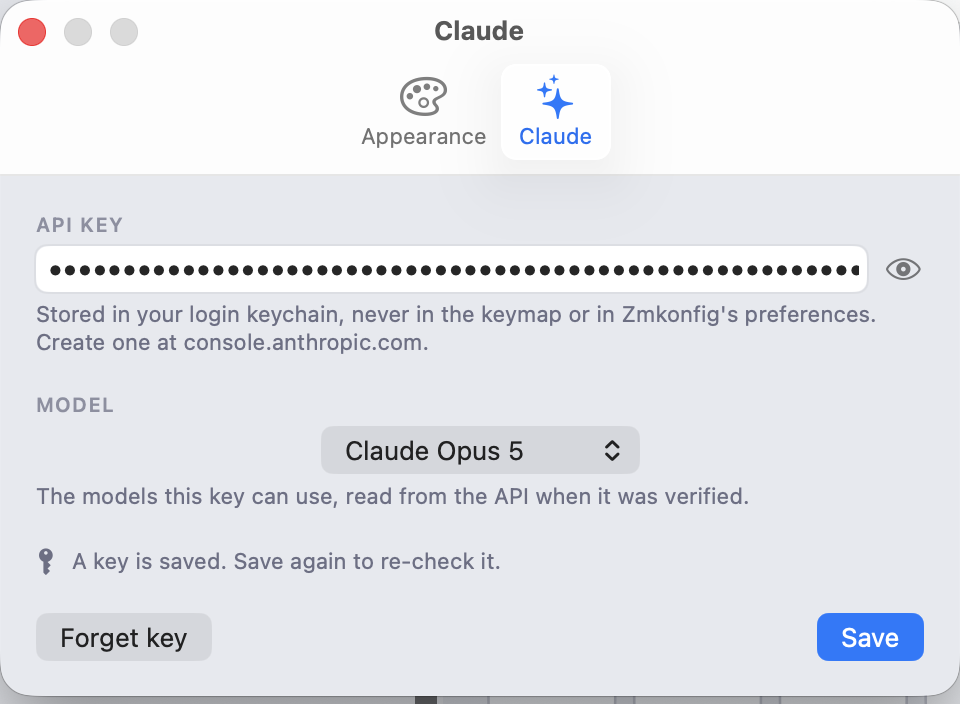
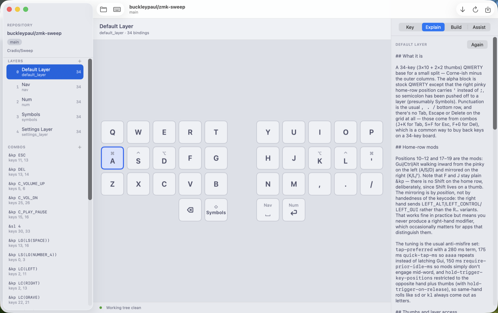
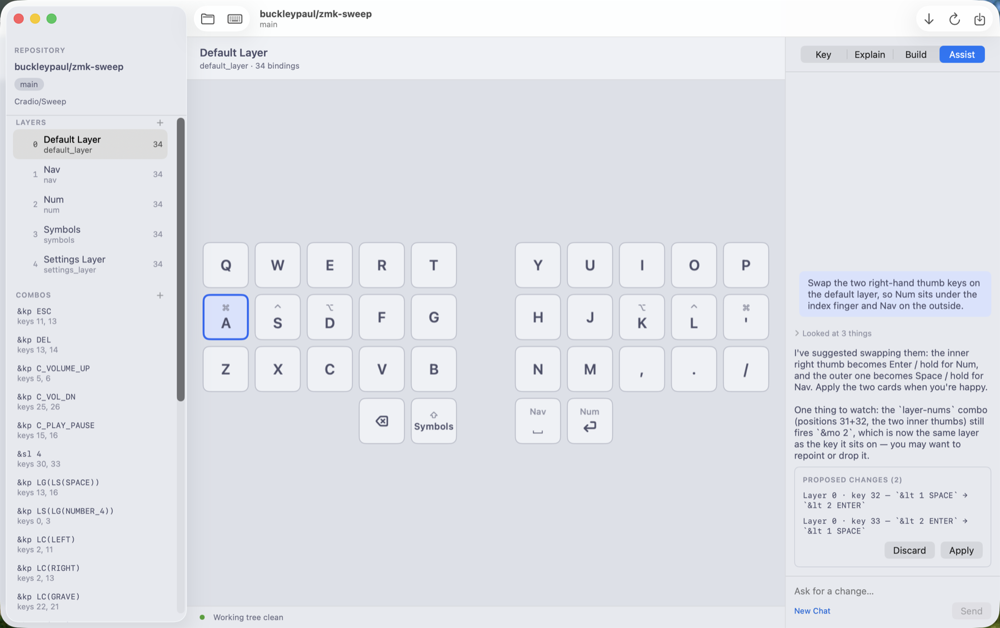
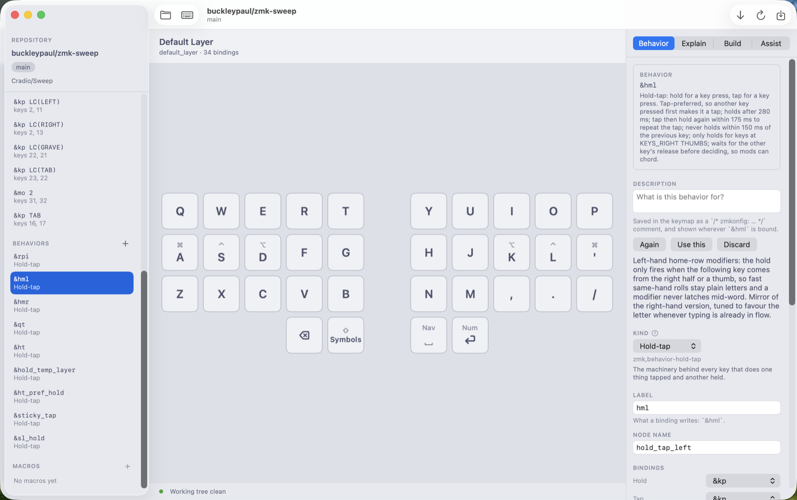

# Zmkonfig

A native macOS keymap editor for [ZMK](https://zmk.dev) keyboards — a desktop
take on [nickcoutsos/keymap-editor](https://github.com/nickcoutsos/keymap-editor),
built for a Ferris Sweep (34 keys, 5 layers) but not tied to it.

It opens a ZMK config repository, draws the keyboard from its layout data, lets
you edit bindings on any layer, writes the `.keymap` file back, shows you the
diff, commits and pushes, watches the GitHub Actions build, and flashes the
resulting firmware onto a mounted bootloader volume — and it will explain any of
it to you in English, or take a request in English and propose the edit.



## Why

A 34-key keymap is mostly invisible. The `.keymap` file is devicetree — a wall of
`&hml LEFT_GUI A` — and the thing you actually want to know ("which finger is
Escape under, and why does `sd` not fire a modifier?") is nowhere in it. The web
editors solve the drawing problem but hand your config to a browser tab. Zmkonfig
draws the board, keeps the file, and adds the layer of prose that neither the file
nor the picture has.

The rule the whole app is built around: **it never regenerates your `.keymap`.**
It parses the devicetree, finds the byte ranges it means to change, and rewrites
only those. Your includes, `#define`s, custom behaviors, macros, comments and
hand-tuned whitespace survive byte for byte. There is a test that re-serializes
an untouched keymap and fails if a single byte moves.

## Install

```sh
brew install buckleypaul/tap/zmkonfig
```

Homebrew builds it from source, so this takes a few minutes and wants Command
Line Tools present. Building locally is also what keeps Gatekeeper out of the
picture: code you compiled yourself is never quarantined, so there is no
notarized download to wait on and no "unidentified developer" dialog to click
through.

The `.app` lands in the Homebrew prefix rather than `/Applications`. Launch it
with `zmkonfig`, or drag `$(brew --prefix zmkonfig)/Zmkonfig.app` to the Dock.

### Requirements

- macOS 15 or later
- Xcode **Command Line Tools** only (`xcode-select --install`) — there is no
  `.xcodeproj` and none is needed
- `git` and `gh` on `PATH` (`gh` provides the GitHub credentials)
- An [Anthropic API key](https://console.anthropic.com) — optional, and only for
  the features under [AI tooling](#ai-tooling). Everything else works without one.

## What it does

1. **Open a repo** — `owner/name`, cloned on first use. The slug you opened
   last is reopened on the next launch.
2. **Pick the layout** — from the repo's own `config/info.json` when it has one,
   otherwise from the remote keyboard catalog (the Sweep is `cradio`).
3. **Edit** — click a key, choose a behavior, fill in one slot per parameter.
4. **Save** — writes the keymap, shows the real `git diff`, then commits and
   pushes on your say-so.
5. **Build and flash** — follows the workflow run for the pushed commit, pulls
   its artifacts, and flashes a half onto a bootloader volume after an explicit
   left/right confirmation.

Errors are shown as they came back, the working tree's state is always on
screen, and a build is never reported as succeeding unless it did.

### Editing a key

Click a key and the inspector shows what it is bound to. Pick a behavior from the
list and the parameter slots change to match it — a hold-tap gets a hold slot and
a tap slot, a layer-tap gets a layer list, `&kp` gets one keycode. Modifier
toggles wrap a keycode as `LG(LS(X))` rather than making you type it. The prose
under the behavior name is generated from the behavior node's own properties, so
a home-row mod tells you its flavor, its tapping term and which positions it will
hold for.

Keycodes come from a searchable picker that knows the difference between the
keyboard page and the consumer page — `K_VOLUME_UP` and `C_VOLUME_UP` are not the
same key — and the ⚠ marks a keycode that is known not to work on some OS, naming
which.



The sidebar carries the rest of the keymap: layers (add, rename, delete), combos,
the behaviors the keymap defines, and macros. Each is edited through the same
inspector.

### Reviewing and committing

Saving writes the file and shows you the real diff before anything is committed.
A one-key change is a one-line diff — that is the surgical-edit rule doing its
job, and it is worth watching.



### Building and flashing

Zmkonfig follows the GitHub Actions run for the commit you pushed, downloads the
firmware artifact when it succeeds, and splits it into the halves it contains.
Flashing wants a bootloader volume mounted (double-tap the reset button) and an
explicit left/right choice — it will not guess which half you are holding.



### At a glance, from the menu bar

Every layer as a small board and every combo as a line, without opening the
editor. Clicking a key hands the selection to the main window rather than editing
anything here.



### The glossary

Every `?` badge in the app opens the same vendored glossary: what a behavior is,
what a property does, what "tapping term" and "flavor" and "sticky" mean, with an
example and links onward to the ZMK docs. It is hand-written and shipped with the
app — upstream publishes no machine-readable prose — and a test fails if a
behavior, kind or property has no entry.



## AI tooling

Optional, off until you add a key, and structurally unable to write devicetree.
Add an [Anthropic API key](https://console.anthropic.com) in Settings (⌘,) →
Claude. The key is verified against the API before it is stored, so a key the API
rejects is never saved.



The key lives in your login keychain — never in a file, never in a default, never
in the keymap, never in a prompt. Model choice is yours; the list is read from the
API with the key you saved.

### Explain — read the keymap back to yourself

Select a layer or a key and ask. Claude gets a primer on ZMK, the behaviors this
keymap defines (with the properties that decide whether a key is a home-row mod),
every layer, every combo, and the layer itself laid out the way the keys sit under
your hands — one line per row, a gap between the halves. It reads the board
spatially, which is most of what a layer means.



Four things can be explained: a **layer**, a single **key** in the context of the
layer around it, a **behavior** the keymap defines, and the **diff** you are about
to commit ("Explain changes" in the review sheet).

### Assist — describe the change, review the proposal

A chat that can read the keymap through tools and *stage* edits. It has
read tools (`list_layers`, `read_layer`, `list_combos`, `find_keycodes`,
`list_behaviors`, `list_behaviors_defined`, `list_macros`, `read_keymap_source`)
and edit tools (`set_binding`, `set_combo`, `remove_combo`, `rename_layer`,
`set_behavior`, `remove_behavior`, `set_macro`, `remove_macro`, `add_layer`,
`remove_layer`).



**The edit tools mutate nothing.** They validate their arguments against the live
keymap, stage a proposal, and tell the model plainly that it has been staged
rather than applied. The proposal sits in the transcript as a card until you press
Apply — and Apply runs the same `KeymapFile` mutators and the same `SourceEdit`
splice as every button in the manual editor.

Note what it did in the screenshot above: asked to swap two thumb keys, it also
flagged that a combo still points at the layer the old key sat on. That is the
part worth having.

### Draft a behavior description

The one path by which model output reaches the file, and it is deliberate. Claude
drafts a plain-English description of a behavior your keymap defines; you press
**Use this** to put it in the Description field; saving writes it as a
`/* zmkonfig: … */` comment beside the node, and the app shows it wherever that
behavior is bound.



Everything on the way in goes through a sanitiser whose output can contain
neither `*/` nor `/*` — a `*` is never allowed to be followed by a `/`, so the
text cannot close the comment, and therefore cannot become devicetree. A note is
also never written by the app on its own: drafting fills a field, and you save.

### The safety model, in one paragraph

No model output becomes devicetree. Explain returns prose nobody keeps. The
assistant's edit tools hand back a typed `ProposedEdit` — one case per mutator
`KeymapFile` already has — so a proposal cannot express an edit the manual editor
could not make, and **no case of it carries devicetree text**. The model names a
layer and a key position; it never writes a node and never picks a byte range.
Behavior descriptions are the single exception, and the sanitiser above is why
they are safe rather than merely discouraged.

## Use cases

- **Read a keymap you inherited.** Clone someone's Sweep config, look at the
  board, and ask what the Nav layer is for.
- **Understand your own timings.** `tap-preferred`, `quick-tap-ms`,
  `require-prior-idle-ms` and `hold-trigger-key-positions` are four numbers that
  decide whether home-row mods are usable. The inspector says what yours mean.
- **Make a change without hand-editing devicetree.** Swap a thumb key, add a
  combo, define a macro — and see the one-line diff it produced.
- **Ship it.** Commit, push, watch the build, flash both halves, all in the same
  window.
- **Keep the file yours.** Nothing is regenerated, so a config full of custom
  behaviors and careful formatting comes out the way it went in.

## Build and run

```sh
make run      # build, assemble .build/Zmkonfig.app, and launch it
make build    # swift build -c release
make bundle   # assemble the .app without launching
make test     # run the suite
make clean
```

`make CONFIG=debug run` does the same with a debug build, which is much faster
to iterate on.

Use `make test` rather than bare `swift test`: with Command Line Tools, SwiftPM
cannot find `Testing.framework` on its own and silently runs zero tests. The
target passes the search paths in for it.

For quick UI work without bundling, `swift run Zmkonfig` also works — the app
sets its own activation policy so the window comes to the front. It is ad-hoc
signed, though, so anything that touches the keychain re-prompts after every
rebuild; use `make CONFIG=debug run` for that.

## Layout

```
Sources/ZmkonfigKit/      library: model, devicetree parsing, services, theme
  Model/                  KeyBinding, KeyboardLayout, ZMKMetadata, the binding
                          algebra, the narrators, the glossary, the context pack
  DeviceTree/             lexer, parser, KeymapFile (surgical edits), SourceEdit
  Services/               Git, RepoManager, LayoutCatalog, GitHubClient, Flasher,
                          Keychain, AnthropicClient
  Theme/                  Theme + ThemeEngine
  Resources/              vendored ZMK behavior, keycode and glossary metadata
Sources/Zmkonfig/         the app: entry point, models, views
Tests/ZmkonfigKitTests/   parser round-trip and layout fixtures
```

## Theming

The app ships two themes, **Plain** and **Catppuccin**, each with a light and a
dark appearance and both defined as data in
`Sources/ZmkonfigKit/Theme/Theme.swift`. Pick one in Settings (⌘,). No view
names a color, size or font directly — each one asks the theme for a token
(`theme.color(.keycapFill)`, `theme.metric(.keyUnit)`,
`theme.font(.keycapPrimary)`), so a new look is a new `Theme` value rather than
a refactor.

To change it without touching the code, drop a JSON file in
`~/.config/zmkonfig/themes/`. It is layered over the built-in theme, so it only
needs the tokens you want to change:

```json
{
  "name": "Warm",
  "light": { "keycapFill": "#FFFDF7", "accent": "#B4551F" },
  "dark":  { "keycapFill": "#241F1A" },
  "metrics": { "keyUnit": 60 },
  "fonts": { "keycapPrimary": { "size": 16, "weight": "bold" } }
}
```

Colors are `#rrggbb`, `#rrggbbaa`, or `system:<name>` (`system:label`,
`system:accent`, `system:windowBackground`, …) for values that should follow
macOS. Themes are picked up at launch, or via **View → Reload Themes**.

## Contributing

Outstanding work lives in [GitHub Issues](https://github.com/buckleypaul/zmkonfig/issues),
prioritised on the [project board](https://github.com/users/buckleypaul/projects/1).
`CLAUDE.md` is the working guide to the codebase — in particular the one rule
about never regenerating the keymap, and the test that enforces it.

## License

MIT. See [LICENSE](LICENSE).
